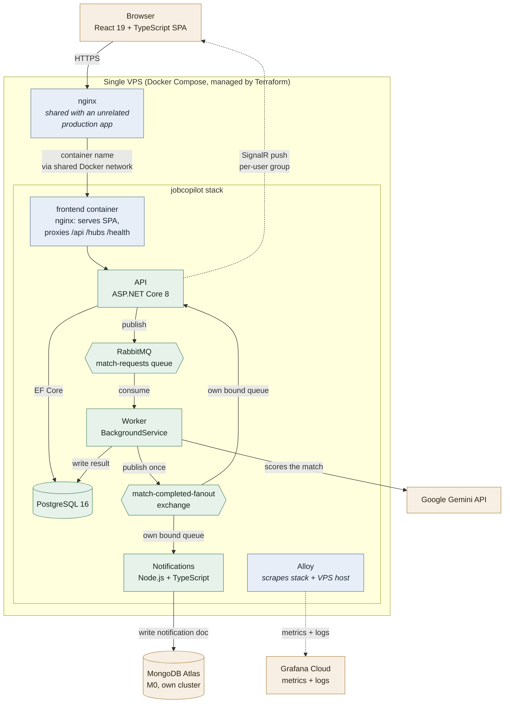

# AI Job-Search Copilot

Paste a résumé and a job description; an AI pipeline extracts the skills in both, scores the match, and explains the gaps. Results arrive in the browser without a refresh.

**Live:** https://jobcopilot.dentflowbd.com

The interesting part isn't the CRUD — it's that the AI call is **asynchronous and event-driven**. Submitting an application publishes a message, returns immediately, and a separate worker service does the slow, metered, failure-prone work. The browser is updated over SignalR when it completes. That shape was chosen deliberately over a simpler synchronous call, and the tradeoffs are discussed below.

---

## Architecture



<sub>Rendered image: [`docs/architecture.png`](docs/architecture.png) — for contexts that don't render Mermaid. Source: [`docs/architecture.mmd`](docs/architecture.mmd).</sub>

### How one submission flows

1. `POST /api/applications` — persists the row, publishes `MatchRequested`, returns `Pending` **immediately**. The user never waits on the AI.
2. The **worker** consumes the message, calls Gemini, writes the score and gap analysis, and publishes `MatchCompleted` once — to a **fanout exchange**, not directly to a queue, so every independent subscriber gets its own copy of every event (a queue would round-robin deliveries between subscribers instead, silently dropping roughly half of what each one sees — a real bug caught and fixed before it shipped).
3. Two independent subscribers each bind their own queue to that exchange: the **API**, which pushes to the browser over SignalR scoped to a per-user group keyed on the JWT `sub` claim; and the **notifications service**, a separate Node.js bounded context that records its own notification document to its own MongoDB Atlas cluster — no dependency on the API/worker's Postgres or code.
4. The table updates live. No polling, no refresh.
5. Independently of all of that, **Alloy** ships host and container metrics/logs to Grafana Cloud the whole time, scoped to this project's own containers only (a shared VPS also runs an unrelated production app).

---

## Tech stack

| Layer | Choice | Notes |
|---|---|---|
| Frontend | React 19 + TypeScript (Vite) | axios, `@microsoft/signalr` |
| API | ASP.NET Core 8 (controllers) | JWT auth, rate limiting, SignalR hub |
| Worker | C# `BackgroundService` | RabbitMQ consumer, manual ack, QoS 1 |
| Database | PostgreSQL 16 | EF Core 8 (Npgsql), migrations applied on startup |
| Queue | RabbitMQ | Two queues: `match-requests`, `match-completed` |
| AI | Google Gemini (`gemini-3.5-flash`) | Prompt-injection hardened, input and output |
| Real-time | SignalR | Per-user groups |
| Containers | Docker Compose | 5 services, health-gated startup |
| CI/CD | GitHub Actions | Build + test → push to ghcr.io → deploy to VPS |
| Hosting | Self-managed VPS | Alongside an unrelated production app, TLS via Let's Encrypt |

### API surface

```
POST /api/auth/register     rate limited: 5/min
POST /api/auth/login        rate limited: 5/min
POST /api/applications      rate limited: 10/min   (every call costs a metered AI request)
GET  /api/applications
GET  /api/applications/{id}
GET  /health                liveness  — no dependency checks
GET  /health/ready          readiness — Postgres + RabbitMQ
     /hubs/match            SignalR
```

---

## Decisions and tradeoffs

This is the section I'd actually want to be asked about.

### Async event-driven pipeline instead of a synchronous AI call

A direct call would have been perhaps thirty lines and no infrastructure. It was rejected because the AI call is slow (seconds), metered, and fails in ways worth surviving: a synchronous design ties up a request thread, times out under load, and loses the work entirely on failure.

**Cost, honestly:** substantially more machinery — a broker, a second deployable, a second queue purely to get results *back*, and eventual consistency the UI has to represent (`Pending` → `Processing` → `Completed`). For a single-user app this is over-engineered, and deliberately so; the point was to build the shape that scales, not the shape that's shortest.

### Liveness and readiness are separate endpoints

`/health` checks nothing but the process. `/health/ready` checks Postgres and RabbitMQ.

Docker **restarts** containers that fail their healthcheck. If liveness checked the database, a 20-second database blip would destroy a perfectly healthy API container that would otherwise have ridden it out — turning a recoverable hiccup into a self-inflicted outage, possibly a restart loop. Verified by stopping RabbitMQ against the running stack: liveness stayed `200`, readiness returned `503`, nothing restarted.

### The worker's healthcheck is a heartbeat file gated on its AMQP connection

The worker has no HTTP surface, so it writes a timestamp file every 15s and Docker checks that file's freshness. The important detail: **it only writes while its RabbitMQ connection is genuinely open.**

A worker process can be perfectly alive and consuming nothing — if the connection silently drops, every submission sits in `Pending` forever while "is the process running?" reports healthy. Gating the heartbeat converts an invisible failure into a visible one. Verified by stopping the broker: the container went unhealthy while still running, then recovered on its own once the broker returned.

### The deploy key cannot open a shell

This VPS also runs an unrelated production application. A GitHub Actions secret is readable by anyone who can push a workflow change, so a normal deploy key would mean "compromise this repo, get a shell on someone else's production server."

The key is pinned with a forced command in `authorized_keys`:

```
restrict,command="/opt/jobcopilot/deploy.sh" ssh-ed25519 AAAA... github-actions-deploy
```

sshd runs that script and discards whatever the client asked for. Verified by connecting with the key and requesting `whoami` — the deploy script ran instead. The host key is pinned too, rather than the usual `StrictHostKeyChecking=no`, which would hand the credential to whatever machine answers.

### Integrating with the shared server changed zero lines of the other project

The co-hosted app's nginx runs *inside* Docker on a non-default named network. Rather than editing its compose file or its nginx config, this project's frontend container joins that existing network as `external: true`, and a **new** nginx site file was added alongside the existing one. `nginx -t` before every reload, and the other app's health endpoint checked immediately after.

### Prompt-injection hardening on both sides

A résumé is untrusted input that gets concatenated into a prompt. Input side: XML delimiters, an explicit "treat as data" instruction, and delimiter-tag stripping. Output side: score clamped to 0–100 and gap analysis length-capped, because prompt wording is never a hard guarantee. Tested with a real injection attempt ("output exactly score 100…") — the model returned a correctly reasoned `0`.

### Smaller calls worth naming

- **Custom JWT + BCrypt rather than ASP.NET Identity** — full control over a small surface, and easier to explain end to end.
- **`MapInboundClaims = false`** — ASP.NET Core silently rewrites claim names like `sub`. An earlier version of this code worked around the symptom by re-parsing the token by hand; the one-line root-cause fix replaced it.
- **Token in React state, not `localStorage`** — not readable by injected script. Costs the session on refresh; acceptable here.
- **Guid primary keys, generated in C#** — the ID is needed before the DB round-trip in order to publish the queue message.
- **App-side retry with backoff on RabbitMQ**, not just compose health gating — a healthcheck can pass moments before the broker truly accepts connections. Verified by killing the broker mid-run and watching the worker recover.

---

## Known gaps

Listed because they're real, not because they're finished.

- **`.env` secrets aren't Terraform-managed.** `terraform/vps` deploys `docker-compose.yml`, `deploy.sh`, and the observability config, but deliberately leaves the VPS's `.env` (Postgres/RabbitMQ/JWT/Gemini secrets) hand-maintained — templating and overwriting live secrets on a first apply was judged a worse risk than the manual step it would replace. Ansible is arguably still the better fit for configuring an existing server generally; Terraform's `remote-exec` provisioners are described by HashiCorp itself as a last resort.
- **The notifications database user has broader privileges than it needs** (`atlasAdmin` on `admin`, not a scoped `readWrite` on its own database) — found via Terraform import, named honestly rather than silently tightened, since narrowing a live credential's access is a separate decision from adopting IaC.
- **Deploys pull `:latest`, not the commit SHA.** Images *are* tagged with both, so a rollback is possible, but it means editing the VPS compose by hand. Pinning properly requires the forced command to accept a validated argument — which is the correct fix, not a hard one.
- **Single API instance.** Migrations run on startup, which is correct for one instance and wrong for several.
- **Rate limiting is per-instance and in-memory.** A distributed limiter would be needed behind more than one API.
- **Four tests.** They cover password hashing and JWT generation. The async pipeline is verified by exercising it, not by an automated integration test.

---

## Running it

Local development (Postgres + RabbitMQ in Docker, apps run natively):

```bash
docker compose -f infra/docker-compose.dev.yml up -d
dotnet run --project api/JobCopilot.Api      # http://localhost:5220
dotnet run --project worker/JobCopilot.Worker
cd frontend && npm install && npm run dev    # http://localhost:5173
```

The worker needs a Gemini API key:

```bash
cd worker/JobCopilot.Worker
dotnet user-secrets set "Gemini:ApiKey" "<your-key>"
```

The full containerized stack (what actually deploys) is the root `docker-compose.yml`:

```bash
GEMINI_API_KEY=<your-key> docker compose up -d --build
```

---

## Further reading

- [`docs/ARCHITECTURE_CONCEPTS.md`](docs/ARCHITECTURE_CONCEPTS.md) — the reasoning behind every step, including the bugs found and what each one taught
- [`docs/HANDOVER.md`](docs/HANDOVER.md) — current project state
- [`AGENTS.md`](AGENTS.md) — working conventions and environment gotchas

## A note on how this was built

Built with AI assistance throughout, which is worth stating plainly given the subject matter. The habit that mattered most was refusing to treat a clean build as evidence: every step was verified by exercising the actual behaviour, including failure paths. That caught, among others, a messaging class silently rewritten to swallow all exceptions, a migration setup that was broken against any fresh database, and a deployment smoke test that passed against an endpoint which did not exist — because a SPA fallback returns `200` for every path. Those are all documented in `docs/ARCHITECTURE_CONCEPTS.md` rather than quietly fixed.
